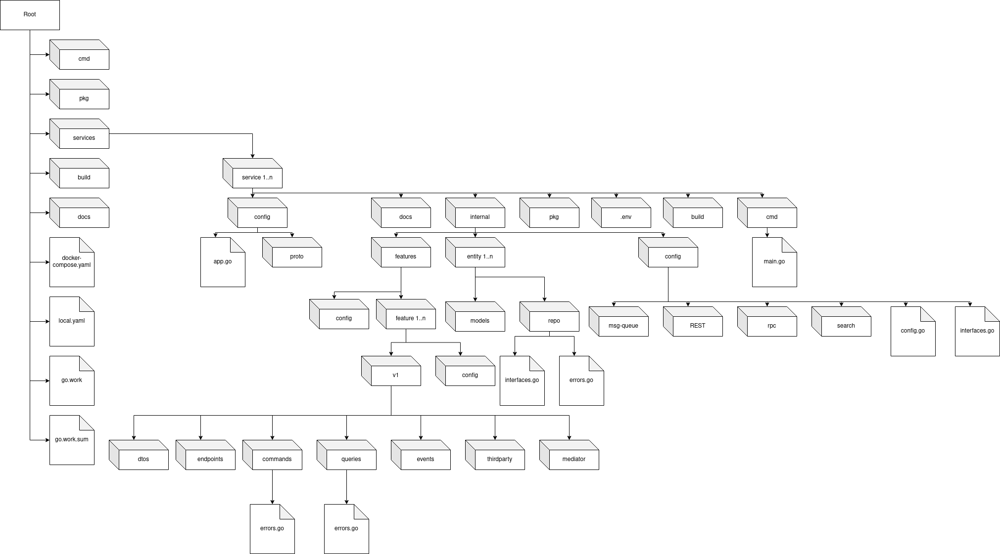

# clean slice template
## Introduction
Welcome! :wave: 

This repo is not business oriented and my focus is mainly on creating codebase structure which is easy to use and maintain by integrating clean slice architecture which is named myself. Basically the architecture I used in this project is comprised of [clean architecture](https://blog.cleancoder.com/uncle-bob/2012/08/13/the-clean-architecture.html) and [vertical slice architecture](https://jimmybogard.com/vertical-slice-architecture/). Both architectures have pros and cons. So why don't we combine them to have an extreme optimized codebase?

:rotating_light: This project is not mature yet. This is just my initial idea so there will be some conflicts in some situations when you actually use this template for your project. So be careful!.
## Problem

As a software engineering, you probably have to struggle with constructing a codebase to meet the most common following requirements:
- Easy to scale that means your codebase have to adapt usecases as much as possible without breaking old code.
- Easy to maintain
- Easy to modify such as deleting, updating new technology without affecting the whole codebase.
- Easy to read for new members

After digging articles and documents all over internet, I found clean architecture and vertical slice architecture might help me to address the problem. Both of architectures have pros and cons and here are some of them from my perspective.

|      | Clean architecture | Vertical slice architecture |
| -----| ------------------ | --------------------------- |
| Pros |Easy to replace an old technology with a new one|Easy to read|
|      |Easy to add a new feature                       |Easy to add a new feature|
|      |Suitable for small projects                     |Suitable for big projects|
|      |Small size of codebase growth                   |Easy to maintain|
| Cons |Hard to read for new members                    |Big size of codebase growth|
|      |Hard to modify                                  |Hard to replace an old technology with a new one|
|      |Hard to maintain                                |Duplicate contents|

So I came up with an idea is Why don't we bring two of them into the picture? By combining them we can use each architecture's strengths to complete the puzzle. 

## Codebase structure

> Above diagram is my solution sketch to take every possible usecases into account before making our hand dirty!
## Technologies
- 🚧️ **[`google/wire`](https://github.com/google/wire)** - Wire is a dependency injection system for Go
- 🚧️ **[`kataras/iris`](https://github.com/kataras/iris)** - The fastest go web framework
- 🚧️️ **[`rabbitmq/amqp091-go`](https://github.com/rabbitmq/amqp091-go)** - A rabbitmq client maintained by rabbitmq team.
- 🚧️️️️ **[`ent/ent`](https://github.com/ent/ent)** - An high-performance entity framework for go.
- 🚧️️️️ **[`stretchr/testify`](https://github.com/stretchr/testify)** - A toolkit with common assertions and mocks that plays nicely with the standard library
- 🚧️️️️️ **[`mehdihadeli/go-mediatr`](https://github.com/mehdihadeli/go-mediatr)** - Mediator pattern implementation in Golang and helpful in creating CQRS based applications.
- 🚧️️️️️️ **[`grpc-ecosystem/go-grpc-middleware`](https://github.com/grpc-ecosystem/go-grpc-middleware)** - Golang gRPC Middlewares: interceptor chaining, auth, logging, retries and more
- 🚧️️️️️️ **[`grpc/grpc-go`](https://github.com/grpc/grpc-go)** - The Go language implementation of gRPC. HTTP/2 based RPC
- 🚧️️️️ **[`elastic/go-elasticsearch`](https://github.com/elastic/go-elasticsearch)** - The official Go client for Elasticsearch
- 🚧️️️️️ **[`olivere/elastic/v7`](https://github.com/olivere/elastic/v7)** - Deprecated: Use the official Elasticsearch client for Go at
- 🚧️️️️️️ **[`swaggo/swag`](https://github.com/swaggo/swag)** - Automatically generate RESTful API documentation with Swagger 2.0 for Go.
- 🚧️️ **[`prometheus/client_golang`](github.com/prometheus/client_golang)** - Prometheus instrumentation library for Go applications
- 🚧️️ **[`mongodb/mongo-go-driver`](https://github.com/mongodb/mongo-go-driver)** - The Go driver for MongoDB
- 🚧️️ **[`go-redis/redis`](https://github.com/go-redis/redis)** - Type-safe Redis client for Golang
- 🚧️️️ **[`go-playground/validator`](https://github.com/go-playground/validator)** - Go Struct and Field validation, including Cross Field, Cross Struct, Map, Slice and Array diving
## Formating
- kebab-case for file/folder naming
- camel-case for variable and function naming
## Roadmap
- 🚧 Construct codebase to adapt usecases as much as possible
- 🚧 Update README
## Contributing
:rotating_light: This is just an innocent idea or a brilliant idea. Who knows? What I mean that there might be someone out there who have already done this before but somehow they found it impractical so that they did not publish them on the internet. But it's worth to give it a shot, right? So right now, I really need your feedbacks if you're interested in my idea. 
And again, I want to know your thoughts about my idea so if you want to contribute to this project, please don't hesitate.

## References
- [https://github.com/mehdihadeli/store-golang-microservices](https://github.com/mehdihadeli/store-golang-microservices)
- [https://github.com/MarioCarrion/todo-api-microservice-example](https://github.com/MarioCarrion/todo-api-microservice-example)